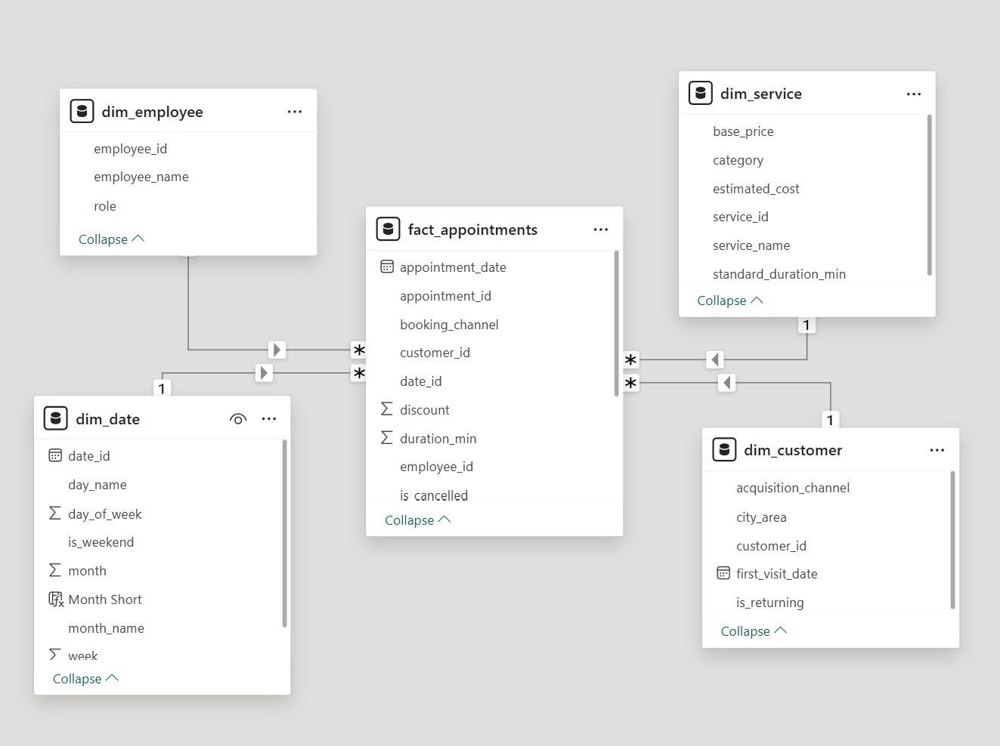

# Beauty Salon Performance Analysis

Power BI project analyzing revenue, no-shows, and operational performance of a beauty salon.

## Project Overview

This project evaluates financial and operational performance to support data-driven decision-making.

The analysis focuses on revenue trends, booking channel efficiency, no-show behavior, and employee contribution.

## Business Questions

- Which booking channel generates the highest revenue?
- Which channel causes the highest financial loss due to no-shows?
- How does no-show rate change over time?
- Are there seasonal performance trends?
- Which employees contribute most to revenue?

## Dashboard Pages

### Owner Overview
High-level KPIs:
- Total Revenue
- Total Appointments
- Average Check
- No-show Rate
- Lost Revenue

### Operations Deep Dive
Detailed operational analysis:
- Revenue by booking channel
- No-show rate by channel
- Monthly trends
- Employee performance
- Financial loss breakdown

## Data Model

The report is built using a Star Schema model:

- Fact table: Appointments  
- Dimension tables: Date, Employee, Service, Customer  

## Key Insights

- Treatwell generates the highest financial loss.
- Website has the highest no-show rate.
- January and November show seasonal peaks.
- Walk-in channel is the most stable.

## Recommendations

- Introduce deposit policy for Website bookings.
- Improve reminder system for Treatwell clients.
- Monitor seasonal spikes in Q1 & Q4.

## Tools & Technologies

- Power BI (DAX, Data Modeling, KPI Design)
- SQL (Joins, Aggregations, Window Functions)
- Google BigQuery (data querying & analysis)
- Star Schema (Fact & Dimension modeling)
- GitHub (Project Documentation)

